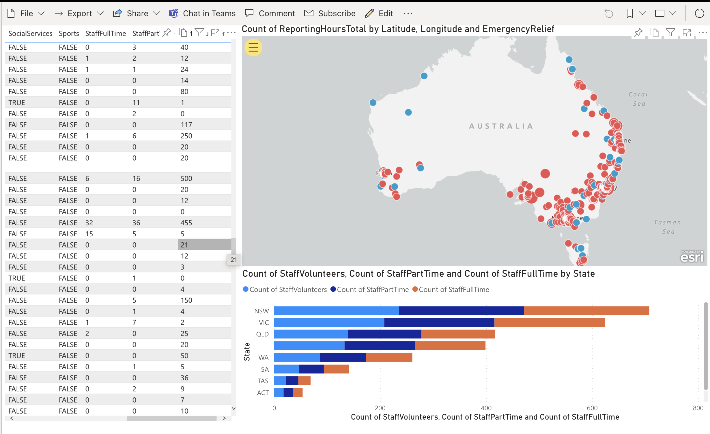

# Azure Functions demo with Python

This application will demonstrate how Azure Functions can be used to convert messy customer data from a spreadsheet into a clean database that can be queried using PowerBI. The intention of the application is to listen for new uploads to a file store, from a non-technical operator (such as an admin), updating a company spreadsheet.

It will:

- Listen for new uploads to an Azure Storage Account blob matching *.xlsx
- Import the data from a function
- Load up pandas to perform some processing and cleanup
- Merge the data with a public postcode database
- Add lat and lon data to the postcodes
- Convert the columns into Azure Table Storage sanitized property names
- Upload the records to Azure Table Storage

Both datasets used in this demo are under Creative Commons licenses,

https://data.gov.au/search?organisation=Australian%20Charities%20and%20Not-for-profits%20Commission%20(ACNC)

Once the data is in Azure Table Storage, you can connect it to PowerBI to create any dashboard, like this:

